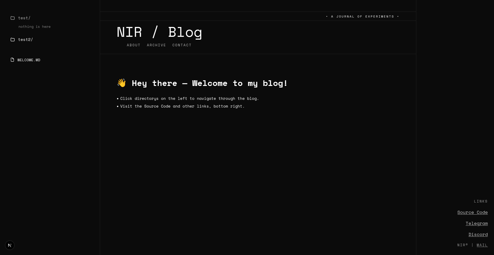

# Minimal Blog

A minimal, dark landing page for Markdown content built with Next.js and TypeScript.



## Features
- Directory-based Markdown publishing under `app/posts`
- Live-rendered posts and dynamic archive powered by the App Router
- Responsive, split layout with sticky archive navigation

## Tech Stack
- Next.js 16 (App Router) + TypeScript
- React 19 client components
- Tailwind CSS v4
- React Markdown + `remark-gfm`

## Getting Started

**Requirements:**  
- Node.js 18.18+ or 20.x  
- `pnpm` 9+ (or use `npm`/`yarn`)

**Install dependencies:**
```bash
pnpm install
```

**Run locally:**
```bash
pnpm dev
```
Then open [http://localhost:3000](http://localhost:3000).

**Other scripts:**
- `pnpm build` — production build
- `pnpm start` — run built app locally
- `pnpm lint` — lint code
- `pnpm test` — run Vitest suite

## Deployment

Build with `pnpm build`. Deploy the `.next` output to Vercel or any Node host (`pnpm start` for production server).

## Docker

The app reads Markdown posts from the path in `POSTS_DIRECTORY` (default `app/posts`). When running in Docker, mount your host posts directory:

```yaml
services:
  blog:
    volumes:
      - ./app/posts:/app/posts:Z
    environment:
      - POSTS_DIRECTORY=/app/posts
```

Posts update immediately on the website when files change since the app uses `revalidate: 0` to fetch fresh data on every request.

## Content

Add Markdown files to `app/posts`. Subdirectories create nested URLs.  
The first post or a file named `welcome.md` is shown by default.

Post changes appear immediately on the website since the app fetches fresh data on every request.

## License

MIT. See `LICENSE` for details.
